# DeskApp

[](https://github.com/hf-jz/DeskAgent)
[](https://github.com/hf-jz/DeskAgent/blob/main/LICENSE)
[](https://github.com/hf-jz/DeskAgent)
[](https://github.com/hf-jz/DeskAgent/actions/workflows/ci.yml)

**不用终端、不用切窗口 —— 桌面上点一下，直接和你的 AI Agent 对话。**
面向所有使用 [hermes-agent](https://github.com/nous-research/hermes-agent) 的开发者：把你已经在跑的 hermes 引擎搬上桌面，变成一个随时待命的悬浮助手。

[中文](#中文文档) · [English](#english-documentation)

---

<a id="中文文档"></a>

# 中文文档

> 仓库名 `DeskAgent`（GitHub）、应用名 `DeskApp`（包名 `deskapp`）—— 指同一个项目。

## 效果演示

**桌面宠物 → 对话 → 推理时间线 → 回答**（点击宠物弹出气泡，实时流式输出，发送按钮 ↑/■ 随运行状态切换）：

<p align="center">
  
</p>

**任务台 Workspace —— 创建任务 / 查看任务 / 任务进度 / 任务模版**：

<p align="center">
  
</p>

**滚轮切换窗口 —— 卡片轮播 + 运行 / 停止**（点活动卡片即运行，再点即停止；关闭 = 彻底停止，后台无影子任务）：

<p align="center">
  
</p>

> 动图由脚本生成（`scripts/gen-demos.py`），界面元素与真实应用一致（暗色玻璃面板 + emerald 强调色）。

**Before** — 在终端里跑 hermes CLI：

```bash
$ hermes chat -q "帮我看看 src/ 目录结构，解释一下各模块的职责"
```

你需要：切到终端窗口 → 敲命令 → 等回复 → 切回编辑器。每次问新问题，重复一遍。

**After** — 用 DeskApp：

```text
桌面上出现 120px 圆形悬浮宠物（WebGL 波浪动画）
  → 点击图标，弹出聊天气泡
  → 输入 "帮我看看 src/ 目录结构，解释一下各模块的职责"
  → 实时看到推理时间线：思考 → 搜索文件 → 读取内容 → 生成总结
  → 对话结束，气泡收起，宠物继续在桌面待命
```

---

## 为什么选 DeskApp

| 痛点 | 方案 |
|---|---|
| 🖱️ 每次用 AI Agent 都要切到终端、敲命令、等输出 —— 打断工作流 | **零摩擦唤醒**：悬浮在所有窗口之上，`Cmd+Shift+M` 一键弹出对话 |
| 💸 所有问题都丢给旗舰模型 —— 简单问答也烧顶级模型的钱 | **双模型大脑**：规则分级路由，简单问题走便宜的 worker 模型，复杂任务才动用 planner 拆解 |
| 🧵 多个 AI 任务只能串行排队 | **多气泡并发**：每个气泡跑独立的 Agent 进程，互不抢线程也不串上下文（并有并发准入，见下） |
| 🔍 AI 回复是黑盒 | **推理透明**：思考折叠卡，推理 → 工具调用 → 结果每一步都可展开查看 |
| 🎯 换电脑后要重新配 agent 环境 | **开箱即用**：读取已存在的 `~/.hermes/config.yaml`，零配置迁移；没有配置时用对话式引导补 |
| 📂 想快速看项目文件还得切 Finder | **桌面即工作区**：内置文件浏览器（List / Grid / Detail 三视图） |
| ⏰ 想让 agent 定时干活 | **定时任务中心 + 日程/项目管理**：一句话生成任务窗口，cron 调度，结果推送收件箱（可选飞书 Webhook） |

---

## 快速上手

### 0. 前置条件

| 需要 | 说明 |
|---|---|
| **macOS** | 当前唯一实测平台（Windows/Linux 的代码分支与打包配置在，但没有真机验证） |
| **Node.js ≥ 24** | `node -v` 确认；推荐 nvm 管理 |
| **一个模型 provider 的 API key** | 首次启动的对话式引导会写入 `~/.hermes/config.yaml` |
| Python 3.11+ | **不需要预装 hermes**：仓库自带 `resources/hermes-agent` 与 `uv`。运行时按序找解释器：① 应用自己的 venv（不存在就用 `uv` 建并装依赖，这一步才有 1–3 分钟自举）→ ② 已装 hermes 的 `~/.hermes/hermes-agent/venv`（有就直接复用，秒级）→ ③ Homebrew / 系统 `python3` |

### 1. 克隆 + 安装依赖

```bash
git clone https://github.com/hf-jz/DeskAgent.git
cd DeskAgent

# 中国大陆网络：Electron 二进制必须走镜像（海外可跳过这一行）
export ELECTRON_MIRROR=https://npmmirror.com/mirrors/electron/

npm install
```

> 报错 `npm error command sh -c node install.js` + `fetch failed` 就是没设上面那行镜像（Electron 二进制默认从 GitHub Releases 拉）。
> 需要严格按 `package-lock.json` 复现安装时用 `npm ci`。
> 仓库约 150MB，因为内置了 hermes-agent 引擎与 `uv` 二进制（都在 `resources/`）。

### 2. 构建并启动

```bash
npm run start
```

`npm run start` = `npm run build` + `electron .`。构建成功的输出形如：

```text
> deskapp@0.1.0 build
> npm run build:shared && npm run build:main && npm run build:preload && npm run build:renderer
...
✓ hit.html + icons + model + ort wasm copied to dist/renderer/
✓ built in 3.9s
```

（具体耗时/体积随版本变化，关键是最后两行没有 error。）

### 3. 预期效果

1. 桌面出现 **120px 圆形悬浮宠物**（WebGL 波浪动画），macOS 托盘出现图标；
2. 点击宠物 → 弹出气泡 → 首次会走对话式引导（填 provider / API key / 模型）；
3. 发第一条消息后，若走的是"自建 venv"路径，引擎会做**一次性自举**（`uv` 建 venv + 装 hermes-agent 依赖 + 预热模型连接），大约 1–3 分钟；如果本机已有 hermes 的 venv 会被直接复用，则是秒级。之后每次启动都直接可用。
4. 之后每次启动都是直接可用。

### 4. 怎么确认"装对了"

```bash
npm run test          # 单元测试：24 个文件 / 159 个用例应全过
```

应用内再点一遍环境自检：**设置 → 活动 → 🩺 环境自检 → 运行自检**，应看到 7 项全 PASS：

```text
PASS  engine bundle: bridge.py + hermes-agent + uv present
PASS  python for engine: Python 3.11.x @ <venv>/bin/python3
PASS  bridge processes: N live (~N*150MB measured) — <key>: … rss, … cpu, up …
PASS  workspace: <userData>/workspace (…MB free), (no profile …)
PASS  model config: <provider> / <model> — api key present (…)
PASS  agent runners: 5 runners — desktop-agent: python3 resources/bridge.py [ready=stdio-frame, jsonl v1, …]
PASS  memory guard: …
```

### 5. 常见问题

| 现象 | 原因 / 处理 |
|---|---|
| `npm install` 卡在 Electron 下载 | 用镜像：`export ELECTRON_MIRROR=https://npmmirror.com/mirrors/electron/` 后重试 |
| 启动后进程立刻退出 | 应用是**单实例**的：已有实例在跑（或残留锁）。删掉 `~/Library/Application Support/deskapp/Singleton*` 后重试 |
| 第一条消息等很久 | 首次引擎自举（1–3 分钟），日志里能看到 `agent pre-created, ready for tasks`；之后不再重复 |
| 气泡一直"思考中" | 首字超时（默认 300s）会以 `[timeout]` 结束该轮并在日志打出 `bridge health: waiting_first_token`；检查 provider 连通性、key 是否有效 |
| 自检 `model config` FAIL | `~/.hermes/config.yaml` 缺 provider/model，或 `~/.hermes/.env` 没有对应 key；跑一次对话式引导即可 |
| 自己打包的 .app 打不开 | 未签名构建：右键 → 打开，或 `xattr -dr com.apple.quarantine /Applications/DeskApp.app` |

---

## 核心特性

| 特性 | 说明 |
|------|------|
| 🐾 **桌面宠物** | 首次启动默认 **Strands**（WebGL 波浪动画）；可在 设置 → 外观 切换到 Mochi / Bobo / Nukey 等角色样式或上传照片宠物。120px 圆形悬浮，贴边自动隐藏 |
| 🧬 **双模型大脑** | planner 规划拆解 + worker 执行（两个槽位在 设置 → LLM 里可配），成本驱动的任务分级路由 |
| 🌲 **任务树可视化** | 复杂任务拆成依赖树，节点状态实时推送 TaskTreePanel |
| 💬 **多气泡并发** | 同时开多个对话窗口，各自独立 Agent 进程；全部轮次共用一条准入队列（默认最多 4 个并发，超出排队） |
| 🧠 **思考时间线** | 思考折叠卡，推理 → 工具 → 结果全流程可展开；推理段落按真实边界切分 |
| 🔧 **工具执行可视化** | Python / 终端 / 浏览器工具调用节点可展开查看详情 |
| 📊 **Agent 仪表盘** | 步骤统计、失败模式、工具执行、能力评分等面板 |
| 🛠 **技能中心** | `~/.deskapp/skills` 注册表，内置 OS 自动化技能首启自动安装 |
| 🗂 **工作区文件浏览** | 独立文件浏览器窗口，List / Grid / Detail 视图 |
| ⚡ **对话式引导** | 宠物在气泡内完成 检测 → 配置 → 验证，无独立向导窗口 |
| ⌨️ **全局快捷键** | `Cmd+Shift+M` 新任务、`Cmd+Shift+E` 文件、`Cmd+Shift+S` 日程、`Cmd+Shift+,` 设置 |
| 🗓 **定时任务中心** | 任务台：创建 / 查看 / 进度（甘特时间线）/ 模版，一键调度 cron |
| 🎡 **滚轮切换窗口** | 卡片轮播 Dock：点击卡片即运行 / 停止，抽出可编辑，拖回即归档 |
| 📤 **结果推送** | 定时任务结果写收件箱；可配飞书 Webhook（含 token 计数） |
| 📅 **日程与会议管理** | 独立 Scheduler 工作窗口：月/周/日三视图、拖拽改期、冲突检测、重复日程、每日简报 cron |
| 🗂 **项目任务管理** | 项目卡片（健康度/里程碑/进度）+ 详情弹窗：KPI、阶段看板、时间线、任务 CRUD |
| 🤖 **Agent 工具集成** | `deskapp_scheduler` 工具：说「添加日程/任务/新建项目」直接落库；今日日程与项目状态注入上下文 |
| 🌐 **全局双语 i18n** | 设置一键切中/英，宠物、气泡、托盘、任务台、Scheduler、设置全界面跟随 |

### 任务台 · 定时任务中心（Workspace）

**任务模型：点播放才运行，否则休眠。**

| 状态 | 含义 | 触发 |
|------|------|------|
| ▶ 休眠 | 无定时任务，后台零进程 | 从未运行 / 已停止 / 已关闭 |
| ⏸ 运行中 | cron 已武装，按计划执行 | 点击播放按钮 |
| ⏹ 停止 | 停用任务 + 中止在跑的执行 | 再点播放按钮（或任务台 Stop） |
| ✕ 关闭 | 删除窗口并删除其任务行 | 卡片红灯 / 任务台删除 |

侧边栏四页：**创建任务**（一句话生成功能窗口，或模版一键创建）、**查看任务**（状态点、cron、下次/上次运行、行内运行/停止/删除）、**任务进度**（甘特时间线，周/双周/月缩放，今日竖线）、**任务模版**（8 个高频模版：定时搜索 / 汇总 / 盯盘 / 巡检 / 异常预警 / 数据看板 / 网页监控 / 晨间简报）。

### 日程与项目（Scheduler 窗口）

月/周/日三视图、原生 `HH:mm` 时间选择、点击卡片编辑（重复支持每天/每周/每月）、日视图拖拽改期（保留时长、钳制 8:00–19:00）、冲突检测（红边 + 悬停提示）、每日简报 cron；项目侧有阶段看板（依赖 ⛓ 标记）、KPI 行、项目时间线、任务 CRUD。数据落在本地 SQLite（`scheduler.db`：events / projects / tasks 三表），预留 CalDAV / EventKit 双向同步接口（`source` / `external_id` 列 + sync IPC 占位）。

---

## 技术栈与架构

**Electron 39 + React 19 + TypeScript 5.9 + Vite 7 + Python Bridge（hermes-agent）**

```text
窗口层 → TaskRouter 分级路由
          ├─ simple  → BridgeManager：每个气泡一个独立 bridge.py 进程（JSON Lines over stdio）
          └─ complex → Orchestrator：planner 拆任务树 → worker 并发执行 → planner 汇总
```

<p align="center">
  
</p>

**核心设计**：每个气泡窗口 = 一个独立 Python 进程运行完整 hermes-agent，通过 JSON Lines 与 Electron 主进程通信 —— 与"开 N 个 terminal 跑 hermes CLI"完全同构。复杂任务走 Orchestrator：planner 拆树（最多 8 节点）→ worker 并发（最多 3 路）→ planner review 汇总，整棵树实时推送 UI；任务树答案完成后注入 bridge 历史，保持跨轮上下文。

### Agent 通信协议

主路径 **Python Bridge**，降级路径 **Hermes Gateway HTTP SSE（端口 8642）**：

```text
stdin :  {"type":"task","message":"…","session_id":"…"} / {"type":"abort"} / {"type":"quit"}
stdout:  {"v":1,"type":"reasoning","content":"…"}
         {"v":1,"type":"reasoning_end"}
         {"v":1,"type":"tool_start","name":"…","args":"…"}
         {"v":1,"type":"health","phase":"running|waiting_first_token","elapsed_ms":N}
         {"v":1,"type":"text","content":"…"}
         {"v":1,"type":"done","elapsed_ms":N,"api_calls":N}
         {"v":1,"type":"error","code":"invalid_config|no_credentials|provider_error|timeout|internal"}
```

每帧带协议版本 `v`（当前 1，见 `src/main/agents/bridge-protocol.ts`），版本不符会被主进程拒绝并只告警一次。

### 并发与内存护栏（为什么多开也不会卡死机器）

每个 bridge 进程实测驻留约 150MB，所以有两道闸门：

1. **准入队列** `src/main/turn-queue.ts`：气泡 / 定时任务 / 生成式 UI / 习惯摘要共用一条 FIFO，默认最多 4 个并发轮次（`DESKAPP_MAX_TURNS`），超出的排队并在气泡里显示「排队中」；
2. **内存护栏** `src/main/mem-guard.ts`：每 60s 采样（`app.getAppMetrics` + 对每个 bridge 用 `ps -o rss` 实测），超软上限回收所有非 pinned 的空闲 bridge 并丢掉热备；单个 renderer 超 1GB 时 reload（10 分钟冷却）。
   气泡自己的 bridge 默认保持热（`IDLE_TIMEOUT_MS = 24h`），后台 bridge 空闲 30 分钟回收。

### 目录结构

```text
DeskAgent/
├── src/
│   ├── main/                 Electron 主进程
│   │   ├── agents/           bridge 生命周期、任务路由、orchestrator、事件总线、协议
│   │   ├── skill-hub/        技能注册表（canonical 格式 ↔ hermes SKILL.md）
│   │   ├── habit/ memory/    习惯与记忆子系统
│   │   ├── ipc-handlers.ts   全部 IPC 通道
│   │   ├── turn-queue.ts     并发准入          mem-guard.ts 内存护栏
│   │   ├── doctor.ts         环境自检          vfs.ts 工作区 + workspace profile
│   │   ├── gen-ui.ts         agent 生成窗口    cron.ts / scheduler.ts 调度
│   │   └── index.ts          应用入口（窗口、托盘、快捷键）
│   ├── preload/              contextBridge API（渲染层唯一入口）
│   ├── renderer/src/         React 界面：pet / bubble / workspace / scheduler / settings …
│   └── shared/               主/渲染共用：IPC 通道表、事件类型、状态词表、locale
├── resources/                运行时资产：bridge.py、内置 hermes-agent、uv、模型、内置技能
├── docs/                     设计与借鉴文档（含 demos/*.svg）
├── tests/                    单元测试（vitest）；tests/e2e 真 Electron e2e（playwright-core）
├── config/                   tsconfig / vite 配置
├── build/ scripts/           打包与辅助脚本（build-dmg.sh、release-mac.sh、gen-demos.py）
└── .github/workflows/        ci.yml（build+test 门禁）、release.yml（tag → dmg）
```

---

## 开发与测试

```bash
npm run dev            # vite dev server + electron（热更新渲染层）
npm run build          # shared + main + preload + renderer 全量构建
npm run test           # 单元测试（vitest）
npm run test:e2e       # 真 Electron e2e（playwright-core，需要桌面会话）
npm run build:mac      # 打包 macOS（build:win / build:linux 同构）
npm run dmg            # 走 scripts/build-dmg.sh 出 DMG
```

另外两个可独立运行的引擎自检（不需要 API key）：

```bash
python3 test_bridge_approval.py    # 审批回调：弹出卡、超时拒绝、无人值守放行留痕
python3 test_bridge_watchdog.py    # 首字看门狗：告警 → 超时终止 → 生产回合心跳
```

### 环境变量（全部可选，用于排障/压测）

| 变量 | 默认 | 作用 |
|---|---|---|
| `DESKAPP_MAX_TURNS` | 4 | 同时执行的 agent 轮次上限（超出排队） |
| `DESKAPP_STALL_MS` | 60000 | 一轮内完全收不到任何帧多久后告警（日志 + 收件箱，不杀） |
| `DESKAPP_MEM_TICK_MS` | 60000 | 内存护栏采样间隔 |
| `DESKAPP_MEM_SOFT_MB` | 1200 | 内存软上限（app metrics 口径） |
| `DESKAPP_MEM_RENDERER_MB` | 1000 | 单个 renderer 超限即 reload |
| `DESKAPP_TURN_SLOT_MAX_MS` | 1800000 | 槽位看门狗：后端卡死时强制归还并发额度 |
| `DESKAPP_HEALTH_TICK_MS` | 5000 | bridge 心跳线程 tick |
| `DESKAPP_FIRST_OUTPUT_WARN_S` | 120 | 等首字超过多久发 `waiting_first_token` 心跳 |
| `DESKAPP_FIRST_OUTPUT_TIMEOUT_S` | 300 | 等首字超过多久以 `[timeout]` 结束该轮 |
| `ELECTRON_MIRROR` | — | Electron 二进制下载镜像（构建/安装用） |

---

## 第三方组件与许可

本项目以 MIT 发布，但**随仓库分发了若干第三方组件**，它们各自保留原有许可：

| 组件 | 位置 | 许可 |
|------|------|------|
| hermes-agent（Nous Research） | `resources/hermes-agent/`（内置引擎，含其 LICENSE） | MIT © 2025 Nous Research |
| uv（Astral） | `resources/uv/uv`（依赖安装器二进制） | MIT / Apache-2.0 |
| U²-Net 分割模型（u2netp） | `resources/models/u2netp.onnx`（宠物抠图） | Apache-2.0 |
| Electron / React / Vite 等 | 由 `npm install` 安装，不入库 | 各自 MIT 等 |

重新分发时请一并保留上述声明。

## 安全

DeskApp 会在你的机器上执行 agent 产生的 shell 命令，并读写 `~/.hermes` 下的模型配置与凭据；工具调用默认需要你在审批卡上确认（定时任务以无人值守模式运行，其每次自动放行都会写审计日志 `userData/audit/*.jsonl`）。漏洞请走私密渠道，详见 [SECURITY.md](SECURITY.md)。

## 许可证

MIT —— 见 [LICENSE](LICENSE)。
Copyright (c) 2026 Hefei Jiuzhai Big Data Technology and Lituo Cloud Intelligence Technology (Nanjing)

---
---

<a id="english-documentation"></a>

# English Documentation

**No terminal, no window switching — one click on the desktop and you're talking to your AI agent.**
Built for everyone already running [hermes-agent](https://github.com/nous-research/hermes-agent): it puts your hermes engine on the desktop as an always-ready floating assistant.

> Repository `DeskAgent` on GitHub, application `DeskApp` (package `deskapp`) — the same project.

## Demos

**Desktop pet → chat → reasoning timeline → answer** (click the pet to open a bubble; streaming output; the send button switches between ↑ and ■ while a turn runs):

<p align="center">
  
</p>

**Workspace — create / inspect tasks, progress, templates:**

<p align="center">
  
</p>

**Scroll-wheel window switcher — card carousel with run / stop** (click an active card to run, click again to stop; closing means fully stopped, no ghost jobs):

<p align="center">
  
</p>

> The animations are generated by `scripts/gen-demos.py`; UI elements match the real app (dark glass panels, emerald accent).

**Before** — running the hermes CLI in a terminal:

```bash
$ hermes chat -q "walk me through the src/ layout and each module's job"
```

You switch to the terminal, type, wait, switch back to your editor. Repeat for every question.

**After** — with DeskApp:

```text
a 120px floating desktop pet appears (WebGL wave animation)
  → click it, a chat bubble pops up
  → ask "walk me through the src/ layout and each module's job"
  → watch the reasoning timeline live: thinking → file search → read → summary
  → the bubble collapses when the turn ends; the pet stays on the desktop
```

## Why DeskApp

| Pain | Solution |
|---|---|
| 🖱️ Every agent question means switching to a terminal and waiting | **Zero-friction wake-up**: floats above all windows, `Cmd+Shift+M` opens a chat |
| 💸 Throwing every question at a frontier model | **Dual-model brain**: rule-based routing sends simple turns to the cheap worker model, complex ones to the planner |
| 🧵 Agent tasks can only run one at a time | **Multi-bubble concurrency**: each bubble runs its own agent process — with an admission queue so the machine never gets buried (see below) |
| 🔍 Agent replies are a black box | **Transparent reasoning**: thinking cards you can expand step by step (reasoning → tool call → result) |
| 🎯 Re-configuring the agent environment on a new machine | **Works out of the box**: reads your existing `~/.hermes/config.yaml`; falls back to a conversational onboarding when there is none |
| 📂 Jumping to Finder just to look at project files | **The desktop is the workspace**: built-in file browser (List / Grid / Detail) |
| ⏰ Wanting the agent to work on a schedule | **Task center + scheduler/projects**: one sentence creates a task window, cron scheduling, results into the inbox (optional Feishu webhook) |

## Quick start

### 0. Requirements

| Need | Notes |
|---|---|
| **macOS** | The only platform actually tested (Windows/Linux code paths and packaging config exist, but are unverified) |
| **Node.js ≥ 24** | check with `node -v`; nvm recommended |
| **An API key for one model provider** | the first-run conversational onboarding writes it to `~/.hermes/config.yaml` |
| Python 3.11+ | **you do not need hermes installed**: the repo ships `resources/hermes-agent` plus `uv`. The interpreter is resolved in order: ① the app's own venv (built with the bundled `uv` and populated on first use — this is the 1–3 minute bootstrap) → ② an existing hermes venv at `~/.hermes/hermes-agent/venv` (reused as-is, seconds) → ③ Homebrew / system `python3` |

### 1. Clone and install

```bash
git clone https://github.com/hf-jz/DeskAgent.git
cd DeskAgent

# behind the Great Firewall the Electron binary must come from a mirror
# (skip this line on a normal network)
export ELECTRON_MIRROR=https://npmmirror.com/mirrors/electron/

npm install
```

> `npm error command sh -c node install.js` + `fetch failed` means that mirror line was missing (the Electron binary is fetched from GitHub Releases by default).
> Use `npm ci` when you need an install that strictly follows `package-lock.json`.
> The repo is ~150MB because it vendors the hermes-agent engine and the `uv` binary (both under `resources/`).

### 2. Build and run

```bash
npm run start
```

`npm run start` = `npm run build` + `electron .`. A successful build looks like:

```text
> deskapp@0.1.0 build
> npm run build:shared && npm run build:main && npm run build:preload && npm run build:renderer
...
✓ hit.html + icons + model + ort wasm copied to dist/renderer/
✓ built in 3.9s
```

(exact timings/sizes vary — what matters is that the last two lines report no error.)

### 3. What to expect

1. A **120px floating pet** (WebGL wave animation) appears, plus a tray icon on macOS;
2. Click the pet → a bubble opens → the first run walks you through provider / API key / model;
3. The first message triggers a **one-time engine bootstrap** (`uv` venv + hermes-agent deps + model warm-up) *only* on the build-its-own-venv path, about 1–3 minutes; if an existing hermes venv is found it is reused and turns start in seconds. Later launches are ready immediately.
4. Every later launch is ready immediately.

### 4. How to verify the install

```bash
npm run test          # unit tests: 24 files / 159 cases should pass
```

Then run the in-app environment check: **Settings → Activity → 🩺 Environment check → Run**, which should report 7 PASS lines (engine bundle, python for engine, bridge processes, workspace, model config, agent runners, memory guard).

### 5. Troubleshooting

| Symptom | Cause / fix |
|---|---|
| `npm install` hangs downloading Electron | use the mirror: `export ELECTRON_MIRROR=https://npmmirror.com/mirrors/electron/` and retry |
| The app exits right after launch | it is **single-instance**: another instance (or a stale lock) is running. Remove `~/Library/Application Support/deskapp/Singleton*` and retry |
| The first message takes minutes | one-time engine bootstrap (1–3 min); look for `agent pre-created, ready for tasks` in the log, it won't repeat |
| A bubble sits on "thinking…" forever | the first-output watchdog (300s default) ends the turn with `[timeout]` and logs `bridge health: waiting_first_token`; check provider connectivity and key validity |
| Self-check reports `model config` FAIL | `~/.hermes/config.yaml` lacks provider/model or `~/.hermes/.env` lacks the key — run the onboarding once |
| A .app you built yourself won't open | unsigned build: right-click → Open, or `xattr -dr com.apple.quarantine /Applications/DeskApp.app` |

## Features

| Feature | What it does |
|------|------|
| 🐾 **Desktop pet** | defaults to **Strands** (WebGL wave) on first run; switch in Settings → Appearance (Mochi / Bobo / Nukey … or upload a photo pet). 120px floating, auto-hides at screen edges |
| 🧬 **Dual-model brain** | planner decomposes + worker executes (both slots configurable in Settings → LLM), cost-aware routing |
| 🌲 **Task tree** | complex goals become a dependency tree, node state streamed live to TaskTreePanel |
| 💬 **Multi-bubble** | several chat windows, each with its own agent process; all turns share one admission queue (4 concurrent by default, extra ones queue) |
| 🧠 **Reasoning timeline** | thinking cards, expandable reasoning → tool → result; segments split on real protocol boundaries |
| 🔧 **Tool visualization** | python / terminal / browser tool calls expandable with details |
| 📊 **Agent dashboard** | step stats, failure modes, tool usage, capability scoring |
| 🛠 **Skill hub** | `~/.deskapp/skills` registry; built-in OS automation skills installed on first run |
| 🗂 **File explorer** | separate window, List / Grid / Detail views |
| ⚡ **Conversational onboarding** | detect → configure → verify, inside the bubble (no separate wizard window) |
| ⌨️ **Global shortcuts** | `Cmd+Shift+M` new task, `Cmd+Shift+E` files, `Cmd+Shift+S` scheduler, `Cmd+Shift+,` settings |
| 🗓 **Task center** | create / inspect / progress (gantt) / templates, one click to schedule cron |
| 🎡 **Card carousel** | click a card to run/stop, pull out to edit, drag back to archive |
| 📤 **Result delivery** | scheduled results go to the inbox; optional Feishu webhook (with token counts) |
| 📅 **Scheduler** | month/week/day views, drag-to-reschedule, conflict detection, recurring events, daily-brief cron |
| 🗂 **Projects** | project cards (health/milestones/progress) + detail dialog: KPIs, phase board, timeline, task CRUD |
| 🤖 **Agent tool integration** | `deskapp_scheduler`: "add an event / task / project" writes straight to the DB; today's agenda is injected into context |
| 🌐 **Bilingual UI** | one switch for Chinese/English across pet, bubbles, tray, task center, scheduler, settings |

### Task center (Workspace)

**Task model: nothing runs until you press play.**

| State | Meaning | Trigger |
|------|------|------|
| ▶ Dormant | no cron job, zero background processes | never run / stopped / closed |
| ⏸ Running | cron armed, fires on schedule | press play |
| ⏹ Stopped | job disabled + in-flight run aborted | press play again (or Stop in the task center) |
| ✕ Closed | window and its task row deleted | card's red light / delete in the task center |

Sidebar pages: **create** (one sentence → a feature window, or a template), **tasks** (state dot, cron, next/last run, inline run/stop/delete), **progress** (gantt timeline with week/biweek/month zoom), **templates** (8 high-frequency ones: scheduled search / digest / market watch / inspection / anomaly alert / dashboard / web monitor / morning brief).

### Scheduler and projects

Month/week/day views, native `HH:mm` picker, click-to-edit (daily/weekly/monthly recurrence), drag-to-reschedule in day view (duration preserved, clamped 8:00–19:00), overlap detection, daily-brief cron; projects side has a phase board (⛓ dependency marks), KPI row, project timeline and task CRUD. Data lives in local SQLite (`scheduler.db`: events / projects / tasks), with placeholder columns for CalDAV / EventKit sync.

## Stack and architecture

**Electron 39 + React 19 + TypeScript 5.9 + Vite 7 + Python bridge (hermes-agent)**

```text
window layer → TaskRouter
                ├─ simple  → BridgeManager: one bridge.py process per bubble (JSON Lines over stdio)
                └─ complex → Orchestrator: planner splits a task tree → workers run in parallel → planner reviews
```

<p align="center">
  
</p>

**Core design**: each bubble window is a separate Python process running a full hermes-agent, speaking JSON Lines with the Electron main process — structurally identical to "open N terminals running the hermes CLI". Complex goals go through the Orchestrator: planner splits (max 8 nodes) → workers run concurrently (max 3) → planner reviews and summarizes; the tree streams to the UI live, and the final answer is injected back into the bridge history so follow-up turns keep context.

### Agent protocol

Primary path **Python bridge**, fallback **Hermes Gateway HTTP SSE (port 8642)**:

```text
stdin :  {"type":"task","message":"…","session_id":"…"} / {"type":"abort"} / {"type":"quit"}
stdout:  {"v":1,"type":"reasoning","content":"…"}
         {"v":1,"type":"reasoning_end"}
         {"v":1,"type":"tool_start","name":"…","args":"…"}
         {"v":1,"type":"health","phase":"running|waiting_first_token","elapsed_ms":N}
         {"v":1,"type":"text","content":"…"}
         {"v":1,"type":"done","elapsed_ms":N,"api_calls":N}
         {"v":1,"type":"error","code":"invalid_config|no_credentials|provider_error|timeout|internal"}
```

Every frame carries the protocol version `v` (currently 1, see `src/main/agents/bridge-protocol.ts`); a mismatching version is rejected with a single warning instead of being half-read.

### Concurrency and the memory guard (why heavy use won't wedge the machine)

A live bridge costs roughly 150MB resident, so there are two gates:

1. **Admission queue** `src/main/turn-queue.ts`: bubbles, cron jobs, generative UI and habit summaries share one FIFO — at most 4 concurrent turns by default (`DESKAPP_MAX_TURNS`), the rest queue and reuse the bubble's existing "queued" notice;
2. **Memory guard** `src/main/mem-guard.ts`: samples every 60s (`app.getAppMetrics` plus a real `ps -o rss` probe per bridge), reclaims every unpinned idle bridge and drops the warm spare above the soft limit, and reloads a single renderer over 1GB (10-minute cooldown).
   A bubble's own bridge stays warm by design (`IDLE_TIMEOUT_MS = 24h`); background bridges are reclaimed after 30 idle minutes.

### Repository layout

```text
DeskAgent/
├── src/
│   ├── main/                 Electron main process
│   │   ├── agents/           bridge lifecycle, task router, orchestrator, event bus, protocol
│   │   ├── skill-hub/        skill registry (canonical format ↔ hermes SKILL.md)
│   │   ├── habit/ memory/    habit and memory subsystems
│   │   ├── ipc-handlers.ts   all IPC channels
│   │   ├── turn-queue.ts     admission control   mem-guard.ts  memory guard
│   │   ├── doctor.ts         environment self-check   vfs.ts  workspace + profile
│   │   ├── gen-ui.ts         agent-generated windows   cron.ts / scheduler.ts
│   │   └── index.ts          app entry (windows, tray, shortcuts)
│   ├── preload/              contextBridge API (the renderer's only door)
│   ├── renderer/src/         React UI: pet / bubble / workspace / scheduler / settings …
│   └── shared/               shared by main + renderer: channels, event types, state vocabulary, locales
├── resources/                runtime assets: bridge.py, vendored hermes-agent, uv, models, built-in skills
├── docs/                     design and reference docs (plus demos/*.svg)
├── tests/                    unit tests (vitest); tests/e2e real-Electron e2e (playwright-core)
├── config/                   tsconfig / vite configs
├── build/ scripts/           packaging and helper scripts
└── .github/workflows/        ci.yml (build+test gate), release.yml (tag → dmg)
```

## Development and testing

```bash
npm run dev            # vite dev server + electron (renderer hot reload)
npm run build          # full build: shared + main + preload + renderer
npm run test           # unit tests (vitest)
npm run test:e2e       # real-Electron e2e (playwright-core, needs a desktop session)
npm run build:mac      # package for macOS (build:win / build:linux are analogous)
npm run dmg            # DMG via scripts/build-dmg.sh
```

Two engine self-checks that run standalone (no API key needed):

```bash
python3 test_bridge_approval.py    # approval callback: cards, timeout deny, unattended runs are logged
python3 test_bridge_watchdog.py    # first-output watchdog: warn → timeout verdict → live-turn heartbeats
```

### Environment variables (all optional, for debugging and load-testing)

| Variable | Default | Effect |
|---|---|---|
| `DESKAPP_MAX_TURNS` | 4 | max concurrent agent turns (extra ones queue) |
| `DESKAPP_STALL_MS` | 60000 | warn (log + inbox, no kill) when a turn receives no frame at all for this long |
| `DESKAPP_MEM_TICK_MS` | 60000 | memory-guard sampling interval |
| `DESKAPP_MEM_SOFT_MB` | 1200 | soft memory limit (app-metrics scale) |
| `DESKAPP_MEM_RENDERER_MB` | 1000 | reload a single renderer above this |
| `DESKAPP_TURN_SLOT_MAX_MS` | 1800000 | slot watchdog: force-return concurrency credit if a backend wedges |
| `DESKAPP_HEALTH_TICK_MS` | 5000 | bridge heartbeat thread tick |
| `DESKAPP_FIRST_OUTPUT_WARN_S` | 120 | emit a `waiting_first_token` heartbeat after this long without output |
| `DESKAPP_FIRST_OUTPUT_TIMEOUT_S` | 300 | end the turn with `[timeout]` after this long without output |
| `ELECTRON_MIRROR` | — | Electron binary download mirror (install/build) |

## Third-party components and licenses

This project is MIT-licensed, but **ships third-party components** that keep their own licenses:

| Component | Location | License |
|------|------|------|
| hermes-agent (Nous Research) | `resources/hermes-agent/` (bundled engine, includes its LICENSE) | MIT © 2025 Nous Research |
| uv (Astral) | `resources/uv/uv` (installer binary) | MIT / Apache-2.0 |
| U²-Net segmentation model (u2netp) | `resources/models/u2netp.onnx` (pet cut-out) | Apache-2.0 |
| Electron / React / Vite etc. | installed by `npm install`, not vendored | their respective licenses |

Please keep these notices when redistributing.

## Security

DeskApp executes shell commands produced by the agent on your machine and reads/writes model configuration and credentials under `~/.hermes`. Tool calls require your confirmation on an approval card by default; scheduled (unattended) runs auto-approve but every auto-approved call is written to an audit log (`userData/audit/*.jsonl`). Please report vulnerabilities privately — see [SECURITY.md](SECURITY.md).

## License

MIT — see [LICENSE](LICENSE).
Copyright (c) 2026 Hefei Jiuzhai Big Data Technology and Lituo Cloud Intelligence Technology (Nanjing)
